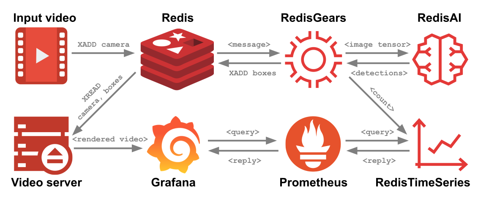

[](https://github.com/RedisGears/EdgeRealtimeVideoAnalytics)
[](https://circleci.com/gh/RedisGears/EdgeRealtimeVideoAnalytics/tree/master)

# RedisEdge Real-time Video Analytics

An example of using Redis Streams, RedisGears, RedisAI, and RedisTimeSeries for Real-time Video Analytics (i.e. counting people).

Given [this input video](https://youtu.be/VqkMaIk6fKc?t=16), the final output looks something like this:


## Overview

This project demonstrates a possible deployment of the RedisEdge stack that provides real-time analytics of video streams.

The following diagram depicts the flows between the system's parts.



The process is a pipeline of operations that go as follows:
1. A video stream producer adds a captured frame to a Redis Stream.
2. The new frame triggers the execution of a RedisGear that:
    1. Downsamples the frame rate of the input stream, if needed.
    2. Prepares the input frame to the model's requirements.
    3. Calls RedisAI to execute an object recognition model on the frame.
    4. Stores the model's outputs (i.e. people counted and their whereabouts inside the frame) in Redis Stream and TimeSeries.
3. A video web server renders the final image based on real-time data from Redis' Streams.
4. Time series are exported from Redis to Prometheus, enabling visualization with Grafana's dashboards.

See ["My Other Stack is RedisEdge"](https://redislabs.com/blog/my-other-stack-is-redisedge/) for a wordy overview.
Watch ["RedisConf19 Keynote Day 2"](https://www.youtube.com/watch?v=t1U7ulz1_Dg&feature=youtu.be&t=4767) for a video demonstration.

### The RedisEdge Stack

The RedisEdge stack consists of the latest Redis stable release and select RedisLabs modules intended to be used in Edge computing. For more information refer to [RedisEdge](https://github.com/RedisLabs/redis-edge-docker).

### YOLO

You Look Only Once, or YOLO for shorts ([good overview](https://leonardoaraujosantos.gitbooks.io/artificial-inteligence/content/single-shot-detectors/yolo.html)), is an object detection neural network. This project uses the "tiny" YOLOv3 model.

## How to get it

Prerequisites:
- [git](https://git-scm.com/)
- [git-lfs](https://git-lfs.github.com/)

```bash
$ git clone https://github.com/RedisGears/EdgeRealtimeVideoAnalytics.git
$ cd EdgeRealtimeVideoAnalytics
$ git lfs install; git lfs fetch; git lfs checkout
```

## How to run it locally

### Installing the RedisEdge stack

Refer to the build/installation instructions of the following projects to set up a Redis server with the relevant Redis modules. This application's connections default to `redis://localhost:6379`.

* [Redis](https://redis.io)
* [RedisGears](https://oss.redislabs.com/redisgears/)
* [RedisTimeSeries](https://oss.redislabs.com/redistimeseries/)
* [RedisAI](https://oss.redislabs.com/redisai/)

Note that you'll also need to install the Pythonic [`requirements.txt`](/redisedge/requirements.txt) for the embedded RedisGears Python interpreter. Here's how:
1. Verify that your host has OpenCV for Python2.7 - if not, install it (`apt-get install python-opencv`)
  1. From your host's command line run the Python 2 interpreter with `python2`
  2. Type `import cv2` - if this succeeds then OpenCV is installed
  3. Type `cv2.__file__` - you should get something like '/usr/lib/python2.7/dist-packages/cv2.x86_64-linux-gnu.so'
  4. Exit the python interpreter (CTRL-D)
2. Go to `/opt/redislabs/lib/modules/python27/.venv/lib/python2.7/site-packages`
3. Create a soft link like so: `ln -s /usr/lib/python2.7/dist-packages/cv2.x86_64-linux-gnu.so cv2.so`
4. Go to `/opt/redislabs/lib/modules/python27`
5. Install the rest of the requirements with `pipenv install numpy pillow`

### (optional) Prometheus and Grafana

Refer to the build/installation instructions of the following projects to set up Prometheus, Grafana and the RedisTimeSeries adapter:

* Prometheus: [Installation](https://prometheus.io/), [config sample](/prometheus/config.yml)
* Grafana: [Installation](https://grafana.com/), [config sample](/grafana/config.ini), [datasource sample](/grafana/provisioning/datasources/prometheus.yaml), [dashboard samples](/grafana/dashboards/)
* [prometheus-redistimeseries-adapter](https://github.com/RedisTimeSeries/prometheus-redistimeseries-adapter)

See below on how to run a partially-dockerized setup that circumvents the need to install these locally.

## The application

The application is implemented in Python 3, and consists of the following parts:

- [`init.py`](/app/init.py): this initializes Redis with the RedisAI model, RedisTimeSeries downsampling rules and the RedisGears gear.
- [`capture.py`](/app/capture.py): captures video stream frames from a webcam or image/video file and stores it in a Redis Stream.
- [`server.py`](/app/server.py): a web server that serves a rendered image composed of the raw frame and the model's detections.
- [`top.py`](/app/top.py): prints runtime performance metrics. Optional (i.e. to be run manually).
- [`gear.py`](/app/gear.py): the Redis gear that glues the pipeline.

To run the application you'll need Python v3.6 or higher. Install the application's library dependencies with the following - it is recommended that you use `virtualenv` or similar:

```sh
$ virtualenv -p python3.6 venv
$ source venv/bin/activate
$ pip install -r app/requirements.txt
```

The application's parts are set up with default values that are intended to allow it to run "out of the box". For example, to run the capture process you only need to type:

```sh
$ python capture.py
```

This will run the capture process from device id 0.

However. Most default values can be overridden from the command line - invoke the application's parts with the `--help` switch to learn of these.

## How to run it with Docker Compose

Prerequisites:
- Docker

### Ubuntu 18.04 (and possibly older versions, other Debian-based distros and all Linux in general)

#### Fully-dockerized

The following will spin up a fully dockerized environment:

```sh
$ docker-compose up
```

Alternatively, you can bring up a lean environment (no fancy [UI](#UI)) with:
```sh
$ docker-compose up redisedge init capture server
```

#### Partially-dockerized

For performance gains, a [local Docker composition](/docker-compose.local.yaml) that includes only the app's initializer, server, grafana, prometheus, and the RedisTimeSeries adapter is provided. Put differently, you need to provide the RedisEdge server and a video stream.

To use it, first make sure that you start your RedisEdge server, e.g.:

```sh
$ ./redisedge/run.sh
```

Then, you can run the rest of the stack with:
```sh
$ docker-compose -f docker-compose.local.yaml up
```

Finally, make sure you actually start capturing something locally, e.g.:
```sh
$ python app/capture.py app/data/countvoncount.mp4
```

**Note:** when switching between fully- and partially-dockerized runs, make sure you rebuild (e.g. `docker-compose up --build`). 

### macOS

#### Fully-dockerized

According to current wisdom, it is impossible to use the webcam from a Docker container on macOS. To work around that, always run the `capture.py` locally on the host.

#### Partially-dockerized (a.k.a. local)

According to current wisdom, 'host' mode networking is a myth on macOS. Hence, the partially-dockerized mode is not available. TL;DR - it is either (almost) fully-dockerized or local for you.

## Performance metrics and notes

1. Docker makes everything slower.
2. The bigger your captured video frames are, the slower this would run.
3. If you don't have a GPU but your CPU supports additional optimizations, consider compiling TensorFlow with them, then RedisAI, and running RedisEdge locally.
4. If you have a GPU, use it (i.e. compile RedisAI for it and `python init.py --device GPU`).

Both the [top tool](/app/top.py) and the [Grafana UI](#UI) provide the following performance metrics:
* in_fps: input (video) frames per second
* out_fps: output (processed by model) frames per second
* prf_read: a moving average of the duration of read (from input video stream) phase in msec
* prf_resize: ditto for resize (input frame to model tensor)
* prf_model: ditto for running YOLO model
* prf_script: ditto for running PyTorch post script
* prf_boxes: ditto for extracting the people boxes from the script's output
* prf_store: ditto for storing the results and the various time-series values]
* prf_total: end-to-end latency in msec for a processed frame

### Unofficial metrics

Metrics sampled by capturing the [Count's video](/app/data/countvoncount.mp4) and using the [application's top tool](/app/top.py):

| Hardware | OS | Dockerized | Device | in_fps | out_fps | prf_read | prf_resize | prf_model | prf_script | prf_boxes | prf_store | prf_total |
|---|---|---|---|---|---|---|---|---|---|---|---|---|
| Macbook Pro 15, 2015 | macOS Mojave | Yes | CPU (no<sup>1</sup>) | 30.0 | 4.5 | 16.1 | 4.4 | 167.5 | 8.6 | 1.9 | 0.5 | 199.0 |
| Macbook Pro 15, 2015 | Ubuntu 18.04 | Yes | CPU (no<sup>1</sup>) | 30.0 | 6.0 | 19.2 | 3.2 | 121.2 | 2.6 | 2.3 | 0.2 | 149.0 |
| Macbook Pro 15, 2015 | Ubuntu 18.04 | No | CPU (yes<sup>2</sup>) | 30.0 | 10.0 | 15.1 | 3.3 | 61.7 | 2.1 | 2.1 | 0.2 | 84.3 |
| AWS EC2 p3.8xlarge | Ubuntu 16.04<sup>3</sup> | No | CPU (no<sup>1</sup>) | 30.0 | 10.0 | 17.9 | 2.9 | 49.7 | 4.5 | 2.5 | 0.2 | 77.7 |
| AWS EC2 p3.8xlarge | Ubuntu 16.04<sup>3</sup> | No | CPU (yes<sup>2</sup>) | 30.0 | 11.0 | 17.6 | 3.9 | 31.6 | 11.9 | 2.4 | 0.2 | 67.6 |
| AWS EC2 p3.8xlarge | Ubuntu 16.04<sup>3</sup> | No | GPU | 30.0 | 30.0 | 16.9 | 3.0 | 2.9 | 1.6 | 1.8 | 0.2 | 26.1 |

Stack versions:
* Redis v5.0.5
* RedisAI v0.2.1
* RedisGears v0.3.1
* RedisTimeSeries v0.2.0

Notes:

1. TensorFlow compiled without any native architecture optimizations
2. TensorFlow compiled with SSE4.1 SSE4.2 AVX AVX2 FMA optimizations
3. Deep Learning Base AMI (Ubuntu) Version 18.0 - ami-075f094614eb7224e

## UI

The application's rendered video stream ([server.py](/app/server.py)) should be at http://localhost:5000/video.

The Docker Compose setup also comes with a pre-provisioned Grafana server - it should be at http://localhost:3000/ (admin/admin). It is configured with the Prometheus data source and video dashboard, so once you log in:

1. Choose 'Dashboards' from the left-dock (2nd icon)
2. Click 'Manage'
3. Click 'Video Stream Analytics'
4. Voila!

Note: if you're installing this project on something that isn't your localhost, you'll need to put its hostname or IP address in the URL of the 'camera:0' Grafana panel for the video to show.

## Known issues, limitations and todos

* TBD
